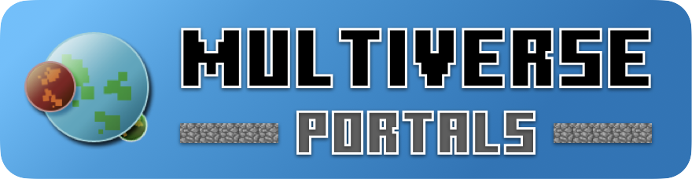

<p align="center">

</p>

[](https://modrinth.com/plugin/Multiverse-Portals)
[](https://hangar.papermc.io/Multiverse/Multiverse-Portals)
[](https://dev.bukkit.org/projects/Multiverse-Portals)


[](https://discord.gg/NZtfKky)
[](https://github.com/sponsors/Multiverse)
[](https://opencollective.com/multiverse-plugins)

## About

[Multiverse Portals](https://dev.bukkit.org/projects/Multiverse-Portals) is an add-on Plugin for [Multiverse Core](https://dev.bukkit.org/projects/multiverse-core) that allows you to create Portals that can teleport players to Multiverse destinations (worlds, anchors or even exact positions), With [Multiverse Command Destination](https://www.spigotmc.org/resources/multiverse-commanddestination.90232/) you can even make portals run commands

Now it's time to create your very own server with Multiverse Portals, do check out our [Wiki](https://mvplugins.org) and [Usage Guide](https://mvplugins.org/portals/fundamentals/basic-usage/) to get started. Feel free to hop onto our [Discord](https://discord.gg/NZtfKky) if you have any questions or just want to have a chat with us!

## Our other amazing sub-modules:

With just [Multiverse Core](https://github.com/multiverse/multiverse) and any of the below plugins, you can access all of these other related features in the Multiverse ecosystem.

* [Multiverse-NetherPortals](https://github.com/Multiverse/Multiverse-NetherPortals) -> Have separate nether and end worlds for each of your overworlds!
* [Multiverse-Inventories](https://github.com/Multiverse/Multiverse-Inventories) -> Have separated players stats and inventories per world or per group of worlds.
* [Multiverse-SignPortals](https://github.com/Multiverse/Multiverse-SignPortals) -> Signs as teleporters!

## Building
Simply build the source with Gradle:
```
./gradlew build
```

## Contributing

**Want to help improve Multiverse Portals?** There are several ways you can support and contribute to the project.
* Take a look at our "Bug: Unconfirmed" issues, where you can find issues that need extra testing and investigation.
* Want others to love Multiverse too? You can join the [Multiverse Discord community](https://discord.gg/NZtfKky) and help others with issues and setup!
* A Multiverse guru? You can update our [Wiki](https://github.com/Multiverse/multiverse-web) with your latest tips, tricks and guides! The wiki open for all to edit and improve.
* Love coding? You could look at ["State: Open to PR"](https://github.com/Multiverse/Multiverse-Portals/labels/State%3A%20Open%20to%20PR) and ["Resolution: Accepted"](https://github.com/Multiverse/Multiverse-Portals/labels/Resolution%3A%20Accepted) issues. We're always happy to receive bug fixes and feature additions as [pull requests](https://www.freecodecamp.org/news/how-to-make-your-first-pull-request-on-github-3/).
* If you'd like to make a financial contribution to the project, do consider donating to our [Github Sponsors](https://github.com/sponsors/Multiverse) or [Open Collective](https://opencollective.com/multiverse-plugins)!

Additionally, we would like to give a big thanks to everyone that has supported Multiverse over the years, as well as those in the years to come. Thank you!

## License

Multiverse-Portals is licensed under BSD-3-Clause License. Please see [LICENSE.md](LICENSE.md) for more info.
